**Информационная система «Face2»***

Руководство пользователя

Версия 1.0

АО «Социальная Карта»

2025 г.

Личный кабинет Face2

Авторизация в личном кабинете

Для авторизации в личном кабинете необходимо перейти по ссылке [https://profile.face2.ru/login](https://profile.face2.ru/login)

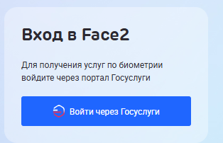

После нажатия на “Войти через Госуслуги” происходит переход на страницу авторизации ЕСИА.

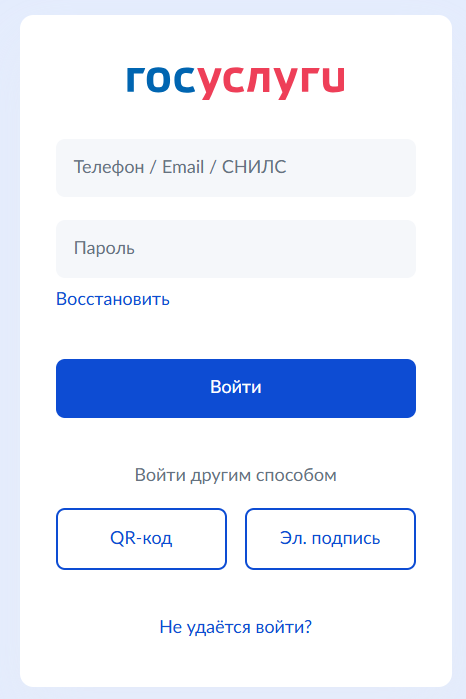

После ввода пользователем логина и пароля ЕСИА отображается страница “Профиль” личного кабинета Face2.

Для выхода из приложения необходимо нажать пиктограмму “Выход”.

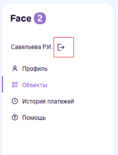

Профиль

На странице “Профиль” отображается следующая информация:

- Способ оплаты;

- Типы биометрии;

- Подключенные объекты;

- Запросы на подключение

Способ оплаты

Способ оплаты могут быть следующими:

- Система быстрых платежей;

- Льготная транспортная карта.

В профиле отображается статус подключения в виде:

  - Не подключено;

  - Подключено.

При нажатии на “Как подключить” отобразится страница с инструкцией о том [как подключить биометрию](https://profile.face2.ru/help/connect) из раздела “Помощь”. Инструкция включает в себя информацию по процессу подключения биометрии и подключению системы быстрых платежей.

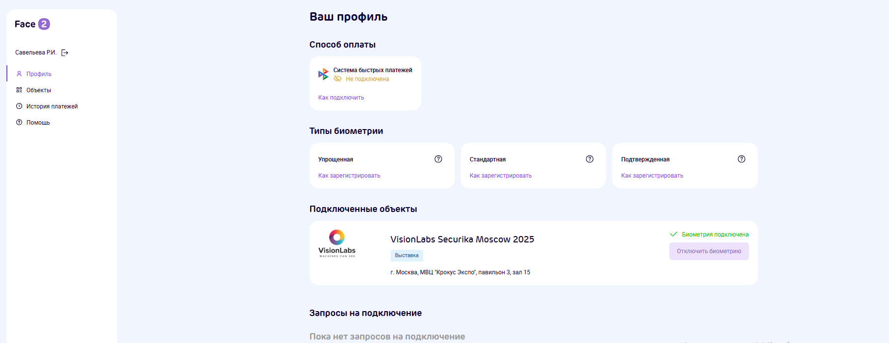

Для подключения СБПэй необходимо скачать приложение “СБПэй” на мобильное устройство и выбрать банк из списка доступных для подключения.

Льготная транспортная карта доступна для проезда в метро. Для подключения льготной транспортной карты требуется наличие оформленной активной транспортной карты и авторизация в личном кабинете.

После авторизации будет доступна смена способа оплаты.

Выдача согласий и подключение биометрической идентификации

Следуя инструкции необходимо скачать приложение “Биометрия” осуществить сдачу биометрических образцов (фото и голос) и выдать согласия:

- Единой биометрической системе

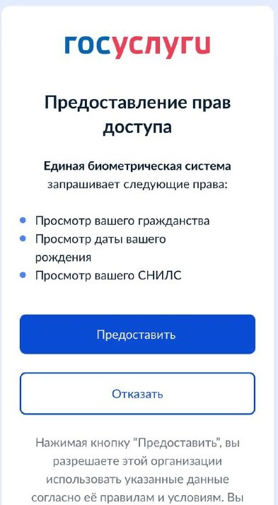

- АО “ЦБТ”

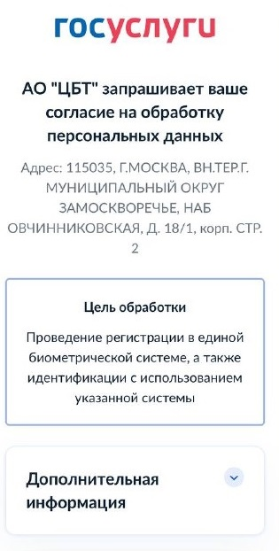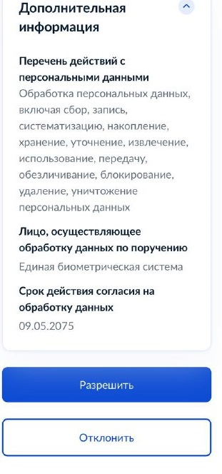

Типы биометрии

На странице личного кабинета отображается информация о типах биометрии, которые могут быть и статус их подключения. При наведении на знак вопроса отображается краткая информация о сроках действия и ограничения по суммам оплат. Типы могут быть следующими:

- Упрощенная биометрия

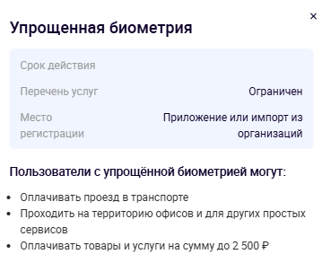

- Стандартная биометрия

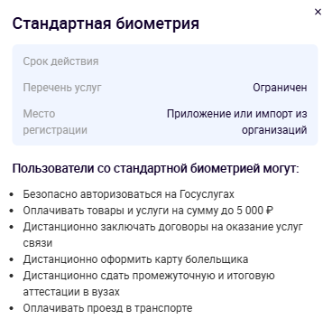

- Подтвержденная биометрия

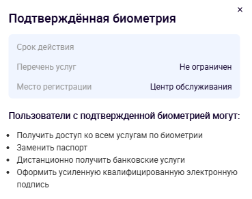

После регистрации биометрических образцов и их подтверждения в ЕБС пользователю отображается срок действия согласия на обработку данных и использование биометрической идентификации: 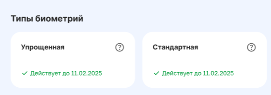

Подключенные объекты

На данной странице отображается информация о том, какие объекты подключены у пользователя.

Объекты отображаются по результатам перехода:

- по QR-коду, который был получен от ответственного лица вашей организации;

- по QR-коду, который был получен из гайда/инструкции с определенного события, например, с выставки;

- при переходе по ссылке из sms-сообщения в процессе подключения биометрической идентификации;

- по ссылке из веб-приложения.

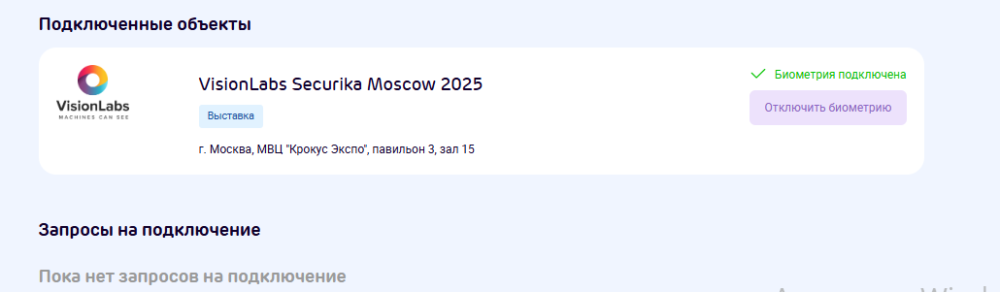

Пользователь может нажать на “Отключить биометрию” после чего отобразится окно подтверждения.

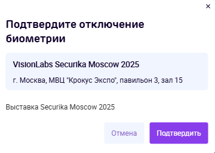

После нажатия на “Подтвердить” отобразится окно о том, что биометрия отключена и объект перестанет отображатся в “Профиле”.

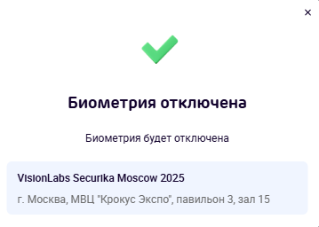

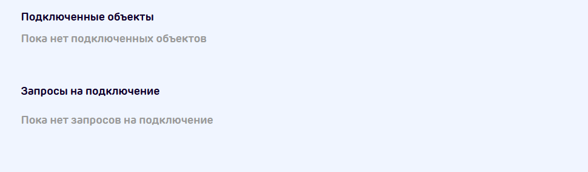

После объект отображается на странице “Профиль” и исчезает из “Объекты”.

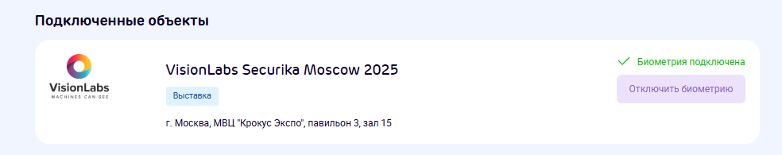

Запросы на подключение

В данном блоке пользователю отображаются объекты, по которым был отпарвлен запрос на подключение.

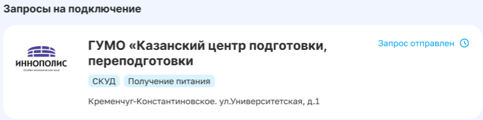

Объекты для подключения

По нажатию на “Объекты” отобразятся возможные для подключения пользователя объекты. Можно повторно осуществить подключение, если пользователь осуществлял отключение. Доступен поиск по объектам.

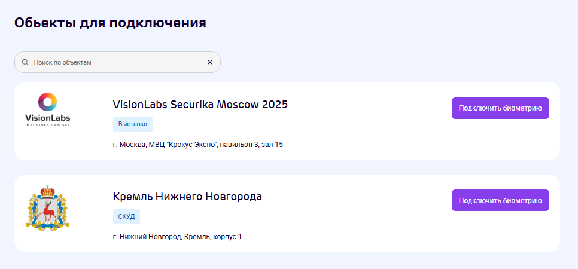

После нажатия на “Подключить биометрию” пользователю отображается следующее окно “Подтвердите подключение биометрии”

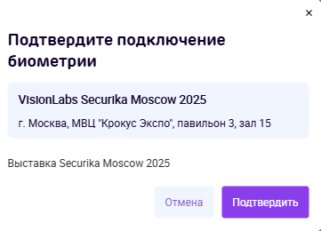

Нажимая “Подтвердить” пользователь соглашается с подключением и ему отображается окно “Запрос на подключение биометрии отправлен”. Биометрия будет подключена, когда запрос на подключение будет подтвержден.

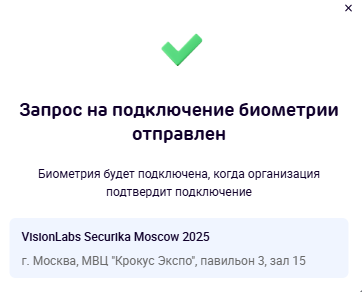

История платежей

После нажатия пользователем на “История платежей” отображается страница с информацией о прошедших списаниях за услуги с использованием биометрической идентификации.

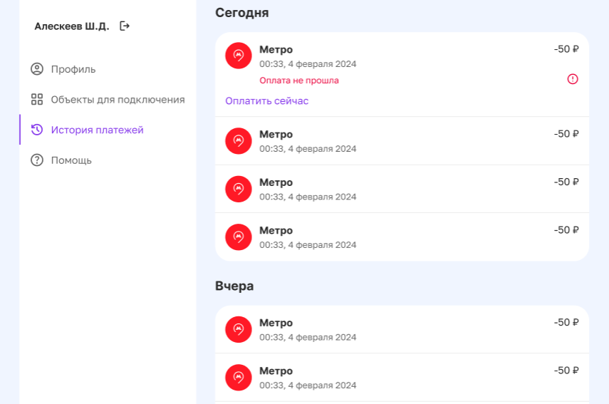

На странице отображается следующая информация:

- Дата;

- Источник;

- Сумма;

- Статус оплаты.

В случае, если пользователь видит, что оплата не прошла необходимо пополнить баланс и нажать “Оплатить сейчас” вручную, если оплата еще не списана автоматически.

Помощь

На странице “Помощь” пользователю отображается следующая информация:

- Как подключить платежи;

- Как подключить биометрию

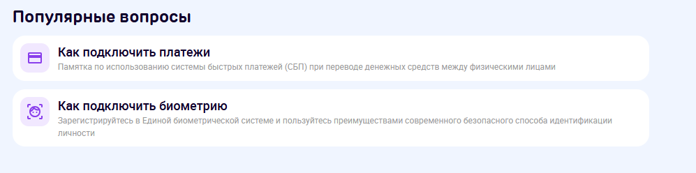

По нажатию на один из блоков отображается страница с подробной инструкцией о том как подключить оплату или биометрическую идентификацию.

Сайт Face2

После нажатия из пункта меню на “Сайт Face2” происходит переход на сайт компании разработчика личного кабинета и системы “Face2”.

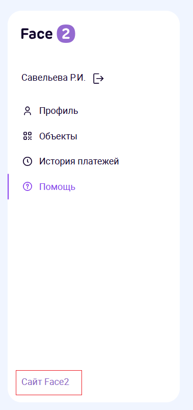

Сайт также доступен по ссылке [https://face2.ru/](https://face2.ru/)

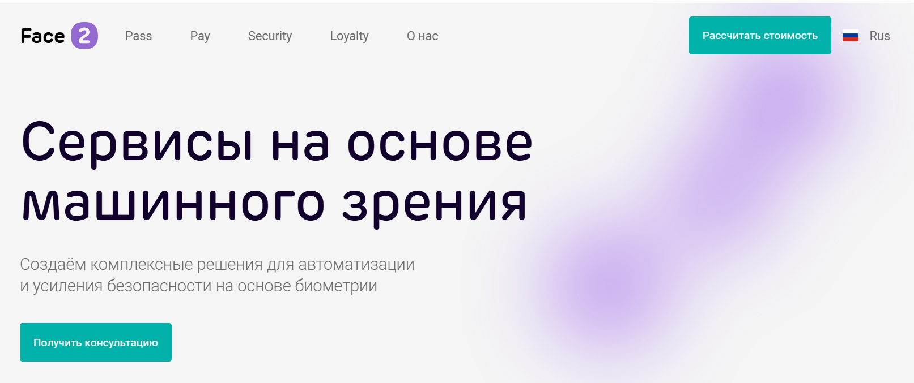

SDK Android

SDK Android позволяет осуществлять оплату товаров и услуг.

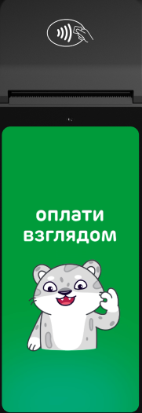

После касания пользователем экрана отображается экран с возможностью оплаты с помощью биометрии.

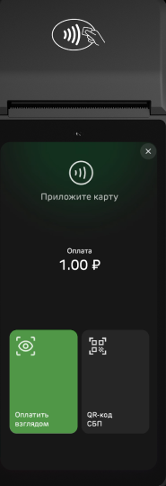

Далее пользователю необходимо посмотреть в камеру

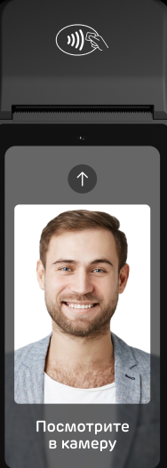

После чего отобразиться статус идентификации и оплаты:

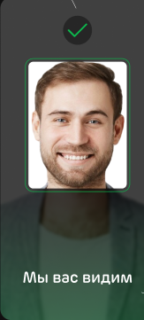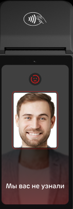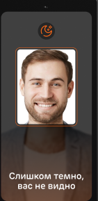
